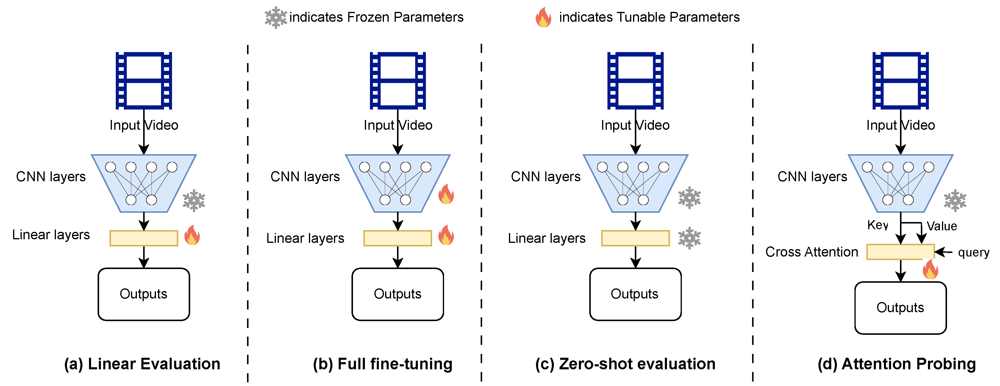

# 🔍 Video Benchmark Suite: Rapid Evaluation of Video Foundation Models

## 🎯 Video Benchmark

- [x] Video Action Recognition (Action Classification)

- [ ] Video Temporal Action Localization (Temporal Action Detection)

- [ ] Video Object Tracking

- [ ] Video Point Tracking

- [ ] Video Depth Estimation

- [ ] Video Camera Pose Estimation

- [ ] Video Instance Segmentation

- [ ] Video Retrieval Text-To-Video (T2V)

- [ ] Video Retrieval Video-To-Text (V2T)

- [ ] Video Temporal Grounding

- [ ] Video Question-Answering

## 📑 SOTA Video Foundation Models

- [x] [V-JEPA: Video Joint Embedding Predictive Architecture](https://ai.meta.com/research/publications/revisiting-feature-prediction-for-learning-visual-representations-from-video/)

- [x] [InternVideo2: Scaling Foundation Models for Multimodal Video Understanding](https://arxiv.org/abs/2403.15377)

- [x] [InternVideo: General Video Foundation Models via Generative and Discriminative Learning](https://arxiv.org/pdf/2212.03191)

- [x] [Unmasked Teacher: Towards Training-Efficient Video Foundation Models](https://arxiv.org/abs/2303.16058)

- [x] [VideoMAE V2: Scaling Video Masked Autoencoders with Dual Masking](https://arxiv.org/abs/2303.16727)

- [x] [VideoMAE: Masked Autoencoders are Data-Efficient Learners for Self-Supervised Video Pre-Training](https://arxiv.org/abs/2203.12602)

- [x] [InternVid: A Large-scale Video-Text Dataset for Multimodal Understanding and Generation](https://arxiv.org/pdf/2307.06942)

- [ ] [VideoPrism: A Foundational Visual Encoder for Video Understanding](https://arxiv.org/abs/2402.13217)

- [ ] [Scaling 4D Representations](https://arxiv.org/abs/2412.15212)

- [ ] [OmniVec2 - A Novel Transformer based Network for Large Scale Multimodal and Multitask Learning](https://openaccess.thecvf.com/content/CVPR2024/papers/Srivastava_OmniVec2_-_A_Novel_Transformer_based_Network_for_Large_Scale_CVPR_2024_paper.pdf)


## 👏 MODEL_ZOO

We provide the sota foundation model weights in [MODEL_ZOO.md](misc/MODEL_ZOO.md).

## 📊 Video Evaluation Method

- 🌸 **Linear Probing Evaluation**
- Few-shot-data Linear Probing Evaluation
- 🌻 **Full Finetuning Evaluation**
- Few-shot-data Full Finetuning Evaluation
- 🍁 **Zero-shot Evaluation**
- Few-shot-data Zero-shot Evaluation
- 🌵 **Attentive Probing Evaluation**
- Few-shot-data Attentive Probing Evaluation



* This image is sourced from the paper [Unifying Video Self-Supervised Learning across Families of Tasks: A Survey](https://www.preprints.org/manuscript/202408.0133/v1).

* Attentive Probing Evaluation is sourced from the paper [Context Autoencoder for Self-Supervised Representation Learning](https://arxiv.org/abs/2202.03026).


## Ours Video Evaluation Details 

### Video Action Recognition

We employ **Linear Probing** and **Attentive Probing** method for rapid evaluation of Action Recognition.

Abbreviations used: pt (pretrain), ppt (post-pretrain), ft (finetune).


#### 💾 Evaluation Dataset

- [Kinetics400](https://arxiv.org/pdf/1705.06950v1)

- [Kinetics600](https://arxiv.org/pdf/1808.01340v1)

- [Kinetics700](https://arxiv.org/pdf/1907.06987v2)

- [Something-Something V2](https://arxiv.org/pdf/1706.04261v2)

- [UCF101](https://arxiv.org/pdf/1711.03273)

- [HMDB51](https://arxiv.org/pdf/1505.04868)

- [Perception Test](https://arxiv.org/pdf/2305.13786)

- [EPIC-KITCHENS-100](https://arxiv.org/pdf/2006.13256v4)

- [RareAct](https://arxiv.org/pdf/2008.01018v1)

- [Diving-48](https://arxiv.org/pdf/1705.06950v1)

- [CholecT50](https://arxiv.org/pdf/2109.03223v2)

- [MentalHAD](https://arxiv.org/pdf/2406.04649v1)

- [UCF101-DS](https://arxiv.org/pdf/2207.01398v2)

- [VFD-2000](https://arxiv.org/pdf/2209.11477v1)

- [Penn Action](https://openaccess.thecvf.com/content_iccv_2013/papers/Zhang_From_Actemes_to_2013_ICCV_paper.pdf)

- [Surveillance Camera Fight Dataset](https://arxiv.org/pdf/2002.04355v1)

- [TinyVIRAT-v2](https://arxiv.org/pdf/2107.11494v1)

- [RoCoG-v2](https://arxiv.org/pdf/2303.10280v2)

- [Composable activities dataset](https://openaccess.thecvf.com/content_cvpr_2014/papers/Lillo_Discriminative_Hierarchical_Modeling_2014_CVPR_paper.pdf)

- [Animal Kingdom](https://arxiv.org/pdf/2204.08129v2)

- [FineGym](https://arxiv.org/pdf/2004.06704v1)

- [RISE](https://arxiv.org/pdf/2005.06111)


#### 🌸 Linear Probing Evaluation

| Hyperparameter          | Info                   |
|-------------------------|------------------------|
| optimizer               | LBFGS                  |
| regularization          | L2                     |
| max_iter                | 1000                   |
| scan Learning rate      | 10<sup>-6</sup>, 10<sup>-4</sup>, 10<sup>-2</sup>, 1, 10<sup>2</sup>, 10<sup>4</sup>, 10<sup>6</sup> |
| spaced steps            | binary search          |
| num_step                | 8                      |
| batch size              | 32                     |
| train class few-shot nums | 10                   |
| val class few-shot nums   | half                 |
| input resolution        | 224×224                |
| mean                    | 0.485, 0.456, 0.406    |
| std                     | 0.229, 0.224, 0.225    |

* This information is referenced from the paper [Learning Transferable Visual Models From Natural Language Supervision](https://arxiv.org/pdf/2103.00020).

* Pytorch LBFGS [Warning](https://pytorch.org/docs/stable/generated/torch.optim.LBFGS.html): Right now all parameters have to be on a single device. This will be improved in the future. 


#### 🌵 Attentive Probing Evaluation

| Hyperparameter          | Info                   |
|-------------------------|------------------------|
| training epoch          | 20                     |
| scan Learning rate      | 1e-3, 3e-4, 1e-4       |
| min Learning rate       | 1e-7                   |
| warmup epoch            | 5                      |
| start Learning rate     | 0.0                    |
| batch size              | 192                    |
| short side size         | 256                    |
| input resolution        | 224×224                |
| optimizer               | AdamW                  |
| adamW weight decay      | 1e-4                   |
| adamW eps               | 1e-8                   |
| adamW betas             | 0.9, 0.999             |
| clip grad               | 5.0                    |
| label smoothing         | 0.1                    |
| attentive head          | 16                     |
| attentive out_dim       | 768                    |
| mean                    | 0.485, 0.456, 0.406    |
| std                     | 0.229, 0.224, 0.225    |
| brightness              | 0.8 probability: delta in [-0.125, 0.125] |
| saturation              | 0.8 probability: factor in [0.6, 1.4]     |
| contrast                | 0.8 probability: factor in [0.6, 1.4]     |
| hue                     | 0.8 probability: delta in [-0.2, 0.2]     |
| color space conversion  | 0.1 probability: RGB to BGR               |

* This information is referenced from the paper [Scaling 4D Representations](https://arxiv.org/pdf/2412.15212).

## 🔨 Installation
 
```bash
apt-get install -y ffmpeg libavcodec-dev libavfilter-dev libavformat-dev libavutil-dev

conda create --name videomae python=3.10 -y
conda activate videomae
conda install pytorch torchvision torchaudio pytorch-cuda=12.1 -c pytorch -c nvidia
pip install decord==0.6.0
pip install nvidia-dali-cuda120==1.44.0
pip install timm==0.4.12
pip install tensorboardX==2.6.2.2
pip install SciPy==1.11.4
pip install matplotlib
pip install scikit-image==0.24.0
pip install flash-attn==2.7.2
pip install psutil==6.0.0
pip install opencv-python
```

## 🚗 Citation

If you find this repository useful, please use the following BibTeX entry for citation.

```latex
@misc{deepglint_videobenchmark2025,
      title={Video Benchmark Suite: Rapid Evaluation of Video Foundation Models}, 
      url={ https://github.com/deepglint/Video_Benchmark_Suite },
      author={Yang, Ninghua and An, Xiang and Ou, Linyu and Feng, Ziyong and Deng, Jiankang},
      year={2025}
}
```

## 👀 Acknowledgement

This repository is built based on [V-SWIFT](https://github.com/deepglint/V-SWIFT), [VideoMAE](https://github.com/MCG-NJU/VideoMAE), [VideoMAEv2](https://github.com/OpenGVLab/VideoMAEv2), [jepa](https://github.com/facebookresearch/jepa), [unmasked_teacher](https://github.com/OpenGVLab/unmasked_teacher), [CLIP_benchmark](https://github.com/LAION-AI/CLIP_benchmark), [vitookit](https://github.com/erow/vitookit), [BlackVIP](https://github.com/changdaeoh/BlackVIP), [open_clip](https://github.com/mlfoundations/open_clip) and [InternVideo](https://github.com/OpenGVLab/InternVideo) repository.


## 📚 License
[MIT License](./LICENSE).
